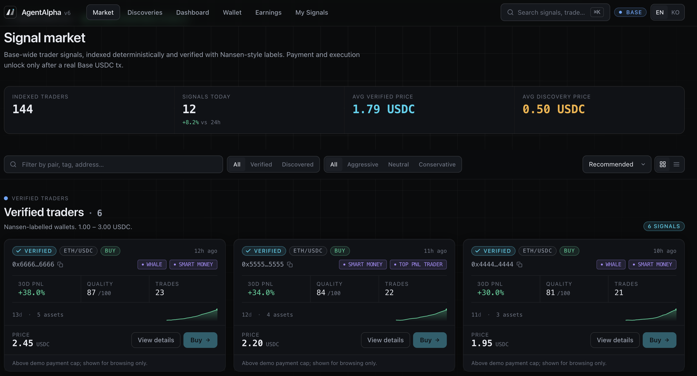
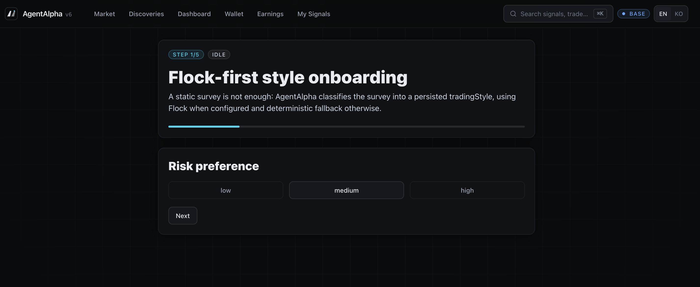

# AgentAlpha v6

**An autonomous AI trading agent marketplace, built on Base.**

> Subscribe to signals from on-chain top traders. Your AI agent executes the trades — automatically.

---

## Signal Market



Browse verified on-chain trader signals with Nansen-style labels (Whale, Smart Money, Top PNL Trader). Filter by trading style, tier, or asset pair. Each signal is priced in USDC and unlocks only after a real Base transaction settles.

---

## Onboarding & Agent Setup



Answer a short survey — AgentAlpha classifies your trading style (Aggressive / Neutral / Conservative) using Flock AI, then issues a dedicated agent wallet via Coinbase CDP. Set your daily spending cap and let the agent run.

---

## How It Works

```
Onboarding survey
  → AI style classification (Flock)
  → Agent wallet issued (Coinbase CDP)
  → Browse Signal Market
  → Purchase signal (x402 · Base USDC)
  → Agent auto-executes swap (PancakeSwap)
  → Earnings & proof on Dashboard
```

---

## Key Features

| Feature | Description |
|---|---|
| **Signal Market** | 144 indexed traders · Verified & Early Discovery tiers |
| **AI Agent** | Matches your profile, pays x402, hands off to PancakeSwap |
| **Revenue Split** | Sellers earn 80% per sale · Derived signals share upstream royalties |
| **On-chain Proof** | Every payment and distribution linked to a real Base tx |
| **Safety Caps** | Daily budget limits enforced server-side · No private key storage |

---

## Stack

| Layer | Tech |
|---|---|
| Frontend | Next.js 14 · TypeScript · Tailwind CSS |
| Chain | Base (Sepolia testnet) |
| Agent Wallet | Coinbase CDP SDK |
| Payment | x402 protocol · Base USDC |
| Swap | PancakeSwap |
| AI Classification | Flock.io |

---

## Quick Start

```bash
cp .env.example .env.local
# Fill in Base Sepolia config
pnpm install
pnpm dev
```

Open `http://localhost:3000`

---

*Built on Base · Powered by Coinbase CDP · AgentAlpha v6*
